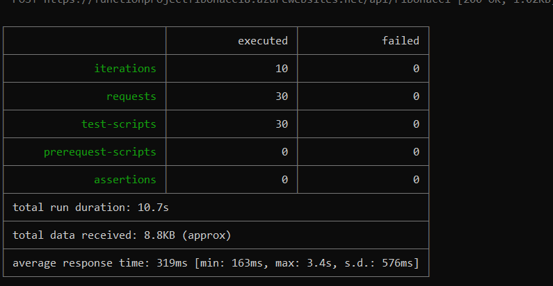
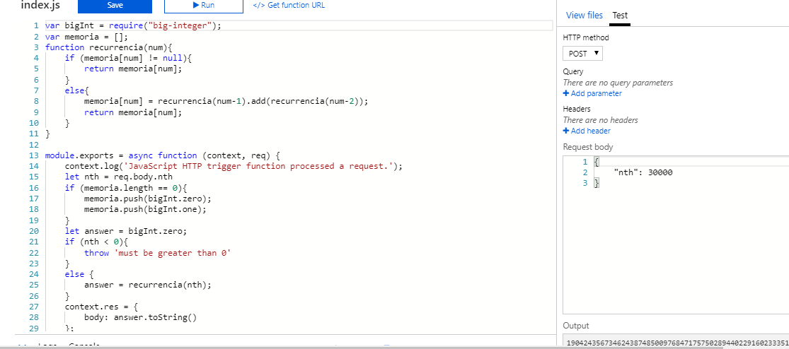

### Escuela Colombiana de Ingeniería
### Arquitecturas de Software - ARSW

## Escalamiento en Azure con Maquinas Virtuales, Sacale Sets y Service Plans

### Dependencias
* Cree una cuenta gratuita dentro de Azure. Para hacerlo puede guiarse de esta [documentación](https://azure.microsoft.com/en-us/free/search/?&ef_id=Cj0KCQiA2ITuBRDkARIsAMK9Q7MuvuTqIfK15LWfaM7bLL_QsBbC5XhJJezUbcfx-qAnfPjH568chTMaAkAsEALw_wcB:G:s&OCID=AID2000068_SEM_alOkB9ZE&MarinID=alOkB9ZE_368060503322_%2Bazure_b_c__79187603991_kwd-23159435208&lnkd=Google_Azure_Brand&dclid=CjgKEAiA2ITuBRDchty8lqPlzS4SJAC3x4k1mAxU7XNhWdOSESfffUnMNjLWcAIuikQnj3C4U8xRG_D_BwE). Al hacerlo usted contará con $200 USD para gastar durante 1 mes.

### Parte 0 - Entendiendo el escenario de calidad

Adjunto a este laboratorio usted podrá encontrar una aplicación totalmente desarrollada que tiene como objetivo calcular el enésimo valor de la secuencia de Fibonnaci.

**Escalabilidad**
Cuando un conjunto de usuarios consulta un enésimo número (superior a 1000000) de la secuencia de Fibonacci de forma concurrente y el sistema se encuentra bajo condiciones normales de operación, todas las peticiones deben ser respondidas y el consumo de CPU del sistema no puede superar el 70%.

### Escalabilidad Serverless (Functions)

1. Cree una Function App tal cual como se muestra en las  imagenes.

2. Instale la extensión de **Azure Functions** para Visual Studio Code.

3. Despliegue la Function de Fibonacci a Azure usando Visual Studio Code. La primera vez que lo haga se le va a pedir autenticarse, siga las instrucciones.

4. Dirijase al portal de Azure y pruebe la function.

5. Modifique la coleción de POSTMAN con NEWMAN de tal forma que pueda enviar 10 peticiones concurrentes. Verifique los resultados y presente un informe.

6. Cree una nueva Function que resuleva el problema de Fibonacci pero esta vez utilice un enfoque recursivo con memoization. Pruebe la función varias veces, después no haga nada por al menos 5 minutos. Pruebe la función de nuevo con los valores anteriores. ¿Cuál es el comportamiento?.

Transcurridos los 5 minutos de inactividad, la aplicación vacia la memoria. Esto hace que al volver a repetir la solicitud hecha, esta tome mucho más tiempo, ya que tiene que volver a calcular todos los números de nuevo.

**Preguntas**

* ¿Qué es un Azure Function?

  Es una modalidad de Azure que nos permite ejecutar y editar fragementos de código en la nube.
  
* ¿Qué es serverless?

  Se define como un tipo de arquitectura en la cual no existen servidores, ya sean físicos o en la nube, sino que el código corre se corre en un "ambiente de ejecución" que generalmente consiste en un contenedor sin estado administrado por un proveedor Cloud, en nuestro caso Azure. Esta arquitectura se caracterisa porque el cliente en este caso no se encarga de la administración de los recursos usados a la hora hora de ejecutar el código, sino que en esta ocasión la responsabilidad recae sobre el proveedor Cloud.

* ¿Qué es el runtime y que implica seleccionarlo al momento de crear el Function App?

  Runtime o tiempo de ejecución es el intervalo de tiempo en el que un programa de computadora se ejecuta en un sistema operativo. Este tiempo se inicia con la puesta en memoria principal del programa, por lo que el sistema operativo comienza a ejecutar sus instrucciones. El intervalo finaliza en el momento en que envía al sistema operativo la señal de terminación.

  Cuando se crea una Function App en Azure, al seleccionar un plan, en este caso el plan Consumption y la versión de runtime 2, se especifica que la duracion es de 5 minutos, osea el tiempo que se mantendra ejecutando la función en memoria de manera continua en la nube.

* ¿Por qué es necesario crear un Storage Account de la mano de un Function App?
  
  Se debe crear porque las funciones dependen de un almacenamiento en Azure para realizar manejo de triggers y el registro de ejecuciones de las funciones
  
* ¿Cuáles son los tipos de planes para un Function App?, ¿En qué se diferencias?, mencione ventajas y desventajas de cada uno de ellos.

  Existen tres tipos de planes: Consumption, Premium y Dedicated. El consumption plan, el cual es el plan por defecto, ofrece los servicios básicos como: escalabilidad automática y pagar solo cuando la aplicación es ejecutada, cuenta con una desventaja importante, y es que su timeout es de 5 minutos, con una memoria máxima por instancia de 1.5 GB y un almacenamiento de 1 GB y un máximo número de instancias de 200. En el plan premium encontramos también una escalabilidad dinámica, aunque en este caso la facturación se hace por el número en segundos de core y la memoria usada en las distintas instancias, este plan ofrece ventajas importantes como: timeouts que si se desea pueden ilimitados, memoria por instancia de 3.5 GB y un almacenamiento de hasta 250 GB, una desventaja de este plan ofrece 100 números de instacias, menor al plan anterior. Por último encontramos el Dedicated o App Service Plan, este se caracteriza principalmento porque en este caso la escalabilidad puede hacerse de manera manual si así lo desea el cliente, también cuenta con las ventajas de: timeouts ilimitados, memoría por instancia de 1.7 GB y una capacidad de almacenamiento de entre 50 a 1000 GB, la principal desventaja de este plan es su número limitado de instancias: de 10 a 20.

* ¿Por qué la memoization falla o no funciona de forma correcta?

  Esto se debe a que el entorno de ejecución libera los datos en memoria de la instancia después de que esta lleva más de 5 minutos inactiva. Además, hay que tener en cuenta que esta App fue hecha utilizando un Consumption plan, el cual nos ofrece 1.5 GB por instanca, esto puede causar que número muy grandes no logren ser calculados por falta de espacio en memoria.  
  
* ¿Cómo funciona el sistema de facturación de las Function App?

  La facturación se hace en base al consumo de recursos y el número de ejecuiones mensuales de un código o función. El consumo de recursos en azure se mide mediante GB-S (gigabytes-segundos), el cual se extrae de la multiplicación del tamaño medio de memoria en GB por el tiempo que dura la ejecución de la función medido en milisegundos. Por otra parte, el número de ejecuciones mensuales cuentan todas las veces que la función es corrida en respuesta a algún evento.

* Informe
